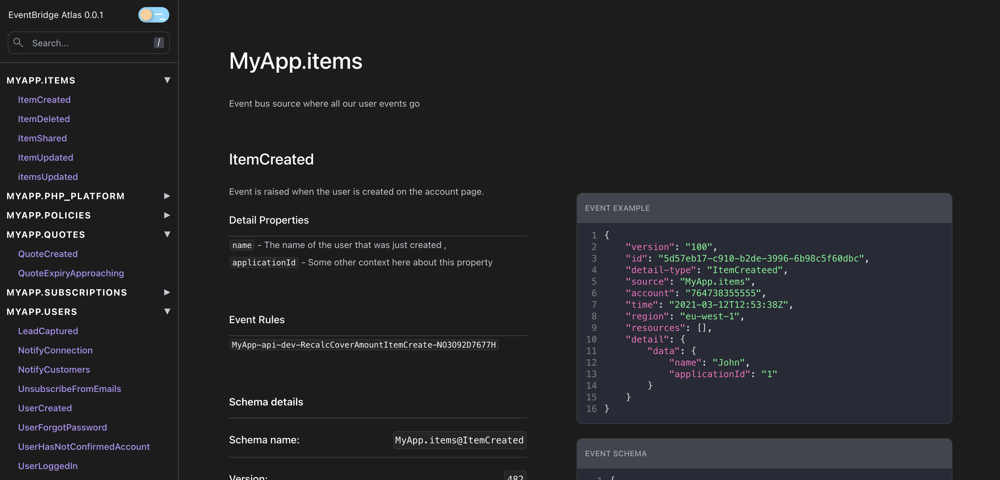
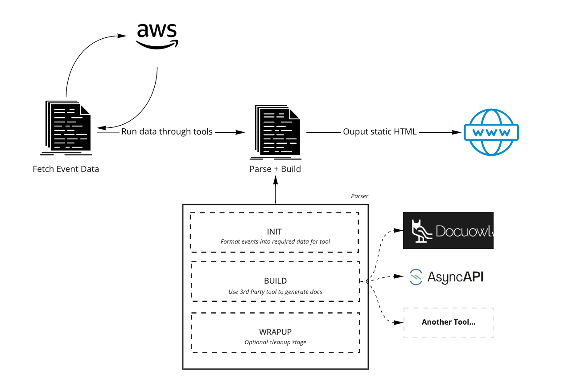
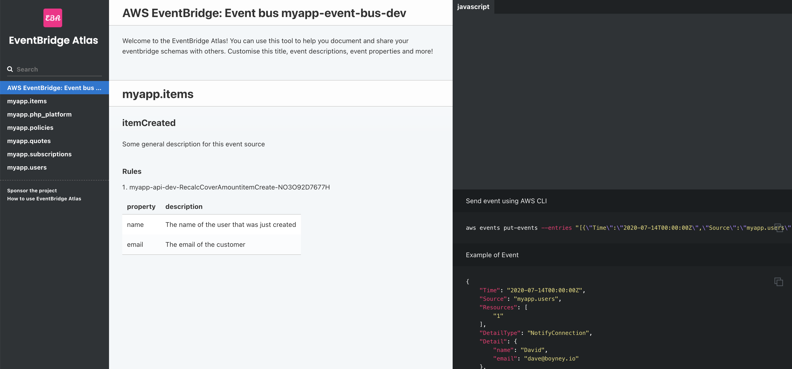
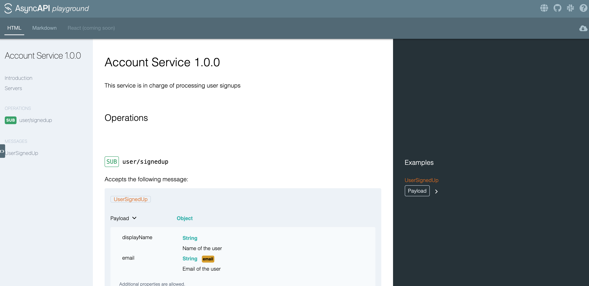
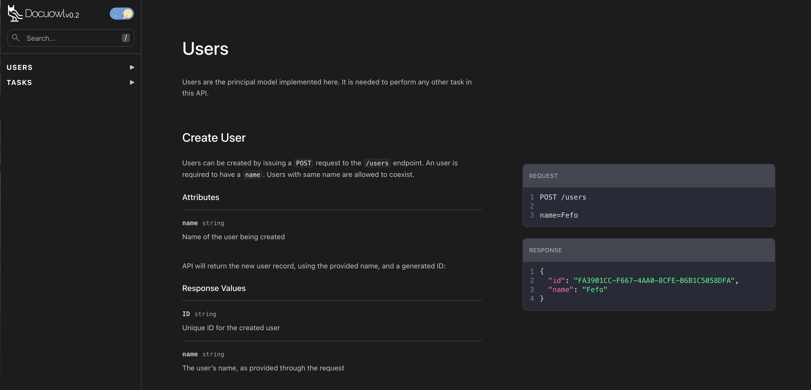

<h2>EventBridge Atlas 🗺</h2>

Document, Discover and Share Amazon EventBridge Schemas.</>

[![MIT License][license-badge]][license]
[![PRs Welcome][prs-badge]][prs]

[![Watch on GitHub][github-watch-badge]][github-watch]
[![Star on GitHub][github-star-badge]][github-star]

  <h3>Features: Parses EventBridge schemas into documentation solutions, shows rules matched to your events, add metadata to each event property, support slate, AsyncAPI and docuowl output, and more...</h3>

[Read the Docs](https://eventbridge-atlas.netlify.app/) | [Edit the Docs](https://github.com/boyney123/eventbridge-atlas-docs)

# The problem

Event-Driven Architectures allow us to scale, be agile and keen our architecture decoupled. Ultimately I believe they help us work more efficiently.

When starting off with Event-Driven Architectures we spend time discovering our core business events, writing code to match them and maintain versions going forward.

Over a period of time more events are added to our domain, requirements change, and our architecture scales.

It can become difficult to know and understand what events are flowing within our domain.

I'm a huge fan of Amazon EventBridge and I wrote this tool to help engineers gain and keep an understanding of events that flow through their domain.

# This solution

EventBridge atlas uses [parsers](https://eventbridge-atlas.netlify.app/docs/parsers/intro) t

EventBridge atlas uses a combination of open source tools to automatically generate documentation for engineers.

EventBridge Atlas downloads your schemas and parses them into various different outputs (you decide) and ouputs static HTML. So you can host your documentation anywhere!

You can read more on [how it works on the website](https://eventbridge-atlas.netlify.app/docs/how-it-works)

# Getting Started

You should be able to get setup within minutes if you head over to our documentation to get started 👇

➡️ [Get Started](https://eventbridge-atlas.netlify.app/)

# Examples

Here are some screenshots of examples of what EventBridge Atlas can produce using its parsers.

Your AWS Schemas are transformed into the following documentation tools:

## Slate Parser

## AsyncAPI Parser

## Docuowl Parser

# Tools

- [Docker](https://www.docker.com/)
- [aws sdk](https://aws.amazon.com/cli/)

### Documentation tools (Parsers)

- [docuowl](https://github.com/docuowl/docuowl)
- [slate](https://github.com/slatedocs/slate)
- [AsyncAPI](https://asyncapi.com)

# Contributing

If you have any questions, features or issues please raise any issue or pull requests you like. I will try my best to get back to you.

[license-badge]: https://img.shields.io/github/license/boyney123/eventbridge-atlas.svg?color=yellow
[license]: https://github.com/boyney123/eventbridge-atlas/blob/main/LICENCE
[prs-badge]: https://img.shields.io/badge/PRs-welcome-brightgreen.svg?style=flat-square
[prs]: http://makeapullrequest.com
[github-watch-badge]: https://img.shields.io/github/watchers/boyney123/eventbridge-atlas.svg?style=social
[github-watch]: https://github.com/boyney123/eventbridge-atlas/watchers
[github-star-badge]: https://img.shields.io/github/stars/boyney123/eventbridge-atlas.svg?style=social
[github-star]: https://github.com/boyney123/eventbridge-atlas/stargazers

# Sponsor

Coming soon 👀

# License

MIT.
