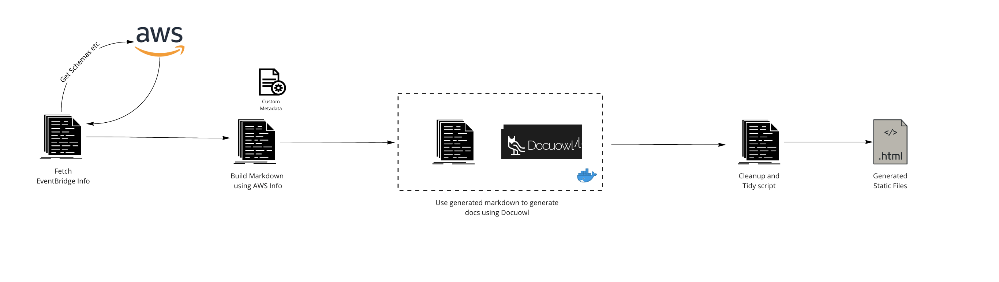

<h2>AWS EventBridge Atlas 🗺</h2>

Document, Discover and Share AWS EventBridge Schemas.</>

[![MIT License][license-badge]][license]
[![PRs Welcome][prs-badge]][prs]

[![Watch on GitHub][github-watch-badge]][github-watch]
[![Star on GitHub][github-star-badge]][github-star]

  <h3>Features: Parses schemas into documentation, shows rules matched to your events, add metadata to each event property, fuzzy search, show example events, light & dark more, and more...</h3>

[Read the Docs](https://eventbridge-atlas.netlify.app/) | [Edit the Docs](https://github.com/boyney123/eventbridge-atlas-docs)

# The problem

Event-Driven Architectures allow us to scale, be agile and keen our architecture decoupled. Ultimately I believe they help us work more efficiently.

When starting off with Event-Driven Architectures we spend time discovering our core business events, writing code to match them and maintain versions going forward.

Over a period of time more events are added to our domain, requirements change, and our architecture scales.

It can become difficult to know and understand what events are flowing within our domain.

I'm a huge fan of AWS EventBridge and I wrote this tool to help engineers gain and keep an understanding of events that flow through their domain.

# This solution

This tool uses a combination of open source tools to automatically generate documentation for engineers.

EventBridge Atlas will output static HTML, so you can host your documentation anywhere!

# Getting Started

EventBridge Atlas has its own documentation website. To get started head over there.

➡️ [Documentation](https://eventbridge-atlas.netlify.app/)

# Tools

- [Docker](https://www.docker.com/)
- [docuowl](https://github.com/docuowl/docuowl)
- [aws cli](https://aws.amazon.com/cli/)

# Contributing

If you have any questions, features or issues please raise any issue or pull requests you like. I will try my best to get back to you.

[license-badge]: https://img.shields.io/github/license/boyney123/eventbridge-atlas.svg?color=yellow
[license]: https://github.com/boyney123/eventbridge-atlas/blob/main/LICENCE
[prs-badge]: https://img.shields.io/badge/PRs-welcome-brightgreen.svg?style=flat-square
[prs]: http://makeapullrequest.com
[github-watch-badge]: https://img.shields.io/github/watchers/boyney123/eventbridge-atlas.svg?style=social
[github-watch]: https://github.com/boyney123/eventbridge-atlas/watchers
[github-star-badge]: https://img.shields.io/github/stars/boyney123/eventbridge-atlas.svg?style=social
[github-star]: https://github.com/boyney123/eventbridge-atlas/stargazers

# Donating

If you find this tool useful, feel free to buy me a ☕ 👍

[Buy a drink](https://www.paypal.me/boyney123/5)

# License

MIT.
